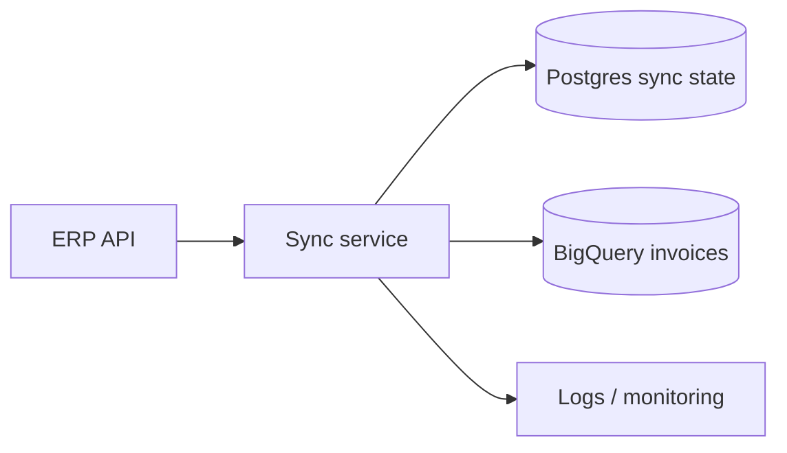
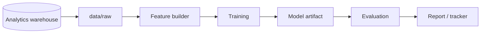

# Example READMEs

Use these as references for tone, structure, length, and visual style. They are examples, not templates to copy blindly.

## Deployed software app

````markdown
# Invoice Sync Service

> Syncs ERP invoices into the data warehouse for finance reporting.

## Contents

- [Why this exists](#why-this-exists)
- [Status](#status)
- [Prerequisites](#prerequisites)
- [Quick start](#quick-start)
- [Verify it works](#verify-it-works)
- [Configuration](#configuration)
- [Architecture](#architecture)
- [Deployment / environments](#deployment--environments)
- [Troubleshooting](#troubleshooting)
- [Owner / contact](#owner--contact)
- [Links](#links)

## Why this exists

Finance needs ERP invoices in BigQuery for reporting.
This service pulls invoices on a schedule, normalizes them, and loads them into the warehouse.
It supports analytics workflows and monthly management reports.

## Status

Active - production since 2025-Q3. Last README review: 2026-05-27.

## Prerequisites

- Docker + Docker Compose
- `uv` for local commands outside containers
- Company VPN access for ERP connectivity
- Real credentials from the Data Platform team

## Quick start

```bash
# 1. Clone
git clone git@github.com:digica/invoice-sync.git && cd invoice-sync

# 2. Configure local environment
cp .env.example .env
$EDITOR .env

# 3. Run the service
docker compose up --build
```

## Verify it works

- Health: `curl http://localhost:8000/health` -> expected `{"status":"ok"}`
- Smoke test: `docker compose exec app pytest tests/smoke`
- Startup logs: `docker compose logs -f app` -> look for `Sync scheduler started`

## Configuration

All environment variables, descriptions, and value sources live in `.env.example`.
Copy it to `.env`, fill the values, and do not commit `.env`.

This service needs ERP API credentials, a warehouse destination, and database connection settings.

## Common commands

```bash
docker compose exec app pytest                  # tests
docker compose exec app ruff check .            # lint
docker compose exec app pyright                 # typecheck
docker compose exec app alembic upgrade head    # DB migrations
```

## Architecture

The scheduler polls ERP hourly, normalizes invoice payloads, and writes them to BigQuery.
Postgres stores sync state and retry checkpoints.



Details: [`docs/ARCHITECTURE.md`](docs/ARCHITECTURE.md).

## Deployment / environments

- **Staging** - `https://invoice-sync.staging.digica.example`
- **Production** - `https://invoice-sync.digica.example`
- **Logs** - see the service dashboard in Grafana
- **Deploy ownership** - Data Platform team

## Troubleshooting

- **Port 8000 is busy** -> change the mapping in `docker-compose.override.yml`.
- **`Missing env var ERP_API_KEY`** -> fill `.env` according to `.env.example`.
- **ERP connection refused** -> confirm VPN is active.
- **Stale migrations** -> run `docker compose exec app alembic upgrade head`.

## Owner / contact

Owner: Data Platform team - Slack `#data-platform`.
Questions and incidents go there.

## Links

- **Docs** - [`docs/`](docs/) and [`docs/ARCHITECTURE.md`](docs/ARCHITECTURE.md)
- **Google Drive** - project folder: `https://drive.google.com/drive/folders/example`
- **Slack** - `#invoice-sync` for discussion, `#data-platform-alerts` for incidents
- **Jira** - INV board: `https://digica.atlassian.net/jira/software/projects/INV/board`
- **Monitoring** - `https://grafana.digica.example/d/invoice-sync`
````

## Data science / mixed project

````markdown
# Churn Prediction Pipeline

> Trains and evaluates churn-risk models for customer-success prioritization.

## Contents

- [Why this exists](#why-this-exists)
- [Status](#status)
- [Prerequisites](#prerequisites)
- [Quick start](#quick-start)
- [Verify it works](#verify-it-works)
- [Configuration](#configuration)
- [Data](#data)
- [Architecture & pipeline](#architecture--pipeline)
- [Results / evaluation](#results--evaluation)
- [Project structure](#project-structure)
- [Troubleshooting](#troubleshooting)
- [Owner / contact](#owner--contact)
- [Links](#links)

## Why this exists

Customer Success needs a weekly ranked list of accounts likely to churn.
This repo prepares product-usage features, trains the model, and evaluates whether the ranking is useful for outreach planning.

## Status

WIP - baseline model is available; production handoff is not complete.

## Prerequisites

- Python 3.12 with `uv`
- Access to the analytics warehouse
- Read access to the shared project data folder
- Optional GPU for larger training runs

## Quick start

```bash
# 1. Clone
git clone git@github.com:digica/churn-prediction.git && cd churn-prediction

# 2. Configure environment
cp .env.example .env
$EDITOR .env

# 3. Install and run a smoke pipeline
uv sync
uv run python -m churn_pipeline.smoke
```

## Verify it works

- Unit tests: `uv run pytest`
- Smoke pipeline: `uv run python -m churn_pipeline.smoke`
- Evaluation dry run: `uv run python -m churn_pipeline.evaluate --sample`

## Configuration

Environment variables are documented in `.env.example`.
The repo needs warehouse credentials, artifact output path, and optional MLflow tracking URI.

## Data

- **Source** - export from the analytics warehouse, documented in the project Drive folder.
- **Local path** - place raw files under `data/raw/`.
- **Generated files** - feature tables go under `data/processed/`.
- **Do not commit** - raw data, processed data, model artifacts, or customer identifiers.

<!-- TODO: add exact Drive folder and warehouse query link -->

## Architecture & pipeline



The pipeline builds account-level features, trains a churn-risk model, and writes evaluation artifacts for review.
Keep architecture and pipeline together unless the runtime deployment becomes a separate service.

## Results / evaluation

Full results live in the experiment tracker and the project report linked below.
Reproduce the current evaluation with `uv run python -m churn_pipeline.evaluate --config configs/baseline.yaml`.

Measure ranking quality and calibration because the business goal is to prioritize the accounts most worth contacting.
Target metrics and thresholds belong in the project report, not as a README leaderboard.

## Project structure

- `src/churn_pipeline/` - feature, training, and evaluation code
- `configs/` - model and evaluation configs
- `data/` - local data, ignored by Git
- `notebooks/` - exploration and analysis notes
- `reports/` - generated local reports, ignored unless explicitly exported

## Troubleshooting

- **Missing `data/raw` files** -> download the export from the project Drive folder.
- **Warehouse auth fails** -> refresh credentials and confirm VPN/access group membership.
- **Native dependency install fails** -> rebuild the `uv` environment and check Python version.
- **Stale artifacts** -> remove `data/processed/` and rerun the feature builder.

## Owner / contact

Owner: Applied ML team - Slack `#applied-ml`.

## Links

- **Docs** - [`docs/`](docs/)
- **Google Drive** - `https://drive.google.com/drive/folders/example`
- **Experiment tracker** - `https://mlflow.digica.example/churn`
- **Slack** - `#churn-prediction`

````

## TODO placeholder

When the user skips a question, leave a visible source comment:

```markdown
## Owner / contact

<!-- TODO: identify owner and Slack channel -->
```

## Closeout example

```text
README.md updated.
Changed: quick start, configuration, architecture, owner/contact.
Why: old README referenced npm commands, but this repo uses uv and Docker Compose.
Verified: uv run pytest, docker compose config.
Remaining TODOs: monitoring link, production URL.
Unverified: docker compose up, because it requires client VPN credentials.
```

## Verification checklist

Use this after changing the skill:

- Frontmatter parses and `name` equals `write-digica-readme`.
- Explicit Digica README requests route to the skill.
- Incidental README mentions do not route to the skill.
- Repository classification covers software, data science, and mixed signals.
- Unknown mandatory facts produce visible `<!-- TODO: ... -->` comments.
- Data science examples do not include README result tables.
- Cheap/safe command verification and risky-command approval are documented.
- Final closeout stays concise: changed sections, why, final effect, verified commands, TODOs, unverified items.
- `skill-cleaner` reports no duplicate old README skill.
